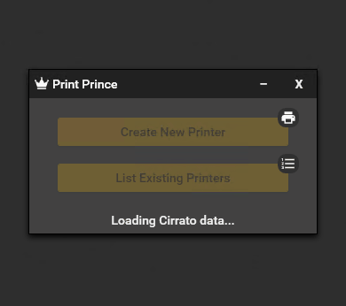
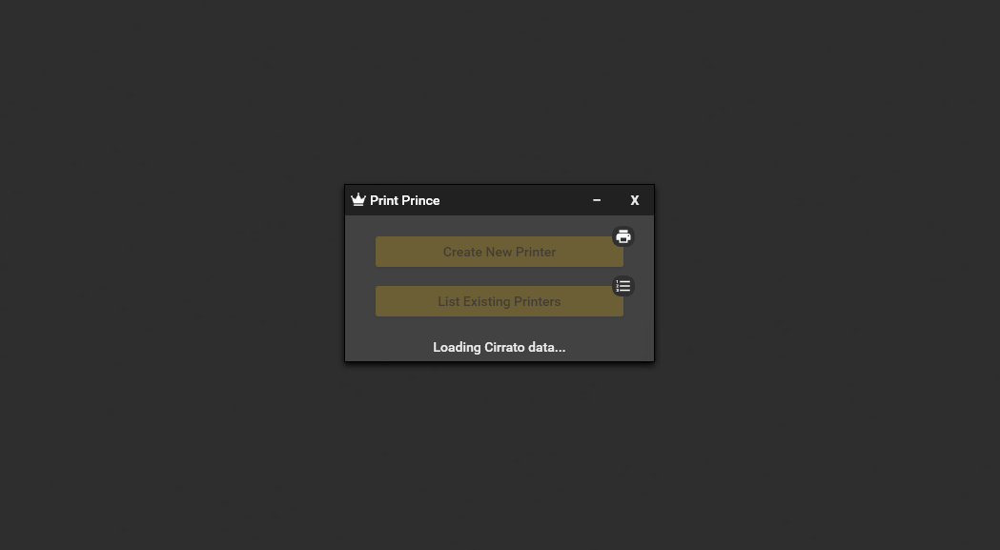

# **Print Prince**
Print Prince aims to centralize administration of printers in environments using both [Cirrato One](https://www.lrsoutputmanagement.com/products/cirrato) and the tool [SysMan (in Swedish)](https://www.inera.se/tjanster/eklient/eklient/) as their printer management.

By using the APIs of Cirrato and SysMan, creation of new printers in each system can be done from a single tool. Print Prince optimizes printer management workflow with a GUI simple and quick enough for even the first line support to use.

* **Flexible** - Using Print Prince enables solutions such as login scripts to install printers through the Cirrato Client's API while still having the benefits of installing printers through SysMan.
* **Modern** - Print Prince replaces the dated Microsoft Management Console, implementing Material Design with a modern look and responsive design focused on user experience.
* **Minimize Mistakes** - When working with two systems and needing to create printers in both it's easy to forget one, Print Prince prevents mistakes by creating the printer in both by default.
* **Maximize Value** - No more of several licenses for the same printer, Print Prince validates creation of printers against both name and IP address in Cirrato to make sure you don't pay double for what you have.
* **Lightweight** - Because Print Prince stores no data on its own, it's quick. All communication happens in the background in real-time with Cirrato and SysMan in your own environment to keep Print Prince responsive.
* **User Authentication** - User rights are assigned in each system, Print Prince then authenticates the user through the APIs to make sure no one unauthorized gets into your systems.

# Requirements
The machine running Print Prince requires at least .NET Framework 4.6.1 and the Cirrato Print Management Client (PMC) installed, configured to the Cirrato system in your environment.

If Print Prince is used from a remote server, ability to communicate with Cirrato and SysMan servers needs to be assured according to port configuration in each system. The default ports of both APIs are TCP 80 and 443 (HTTP/HTTPS).

## **Setup**
Install Print Prince through the setup file among the releases, download the zipped tool for a portable version or build the project on your own.

### **Configuration**
Print Prince comes with a .config file where the Cirrato Print PMC installation path and SysMan URL need to be set.

### **Rights**
* Cirrato API rights are assigned through a separate AD group for the API, set in the Cirrato Configuration Manager where direct membership of the user is required (no nested groups because of how Cirrato works).
* SysMan API rights are shared with the normal rights assignment in the SysMan settings, Print Prince uses the credentials of the user running the application for SysMan communication.

## **Using Print Prince**

### **Logging into Print Prince**
When using Print Prince the user needs to log into the Cirrato PMC. If the user is not already logged into the PMC from a separate source, Print Prince will handle the login by prompting the user when started.

### **Creating a Printer**
When creating a printer, Print Prince checks in Cirrato for printers that contain three underscores, matching the naming convention SITE_BUILDING_FLOOR_xx where xx is a series of numbers starting at 01. Print Prince suggests the first available number in the series, but the name can be changed freely afterwards if desired.
Print Prince requires each field to be filled, and verifies that the name and IP address is not already used by a printer in Cirrato.

### **Listing Printers**
Print Prince lets you easily list all printers in Cirrato with their associated information. If they don't exist with the same name in SysMan they are marked red to make troubleshooting easier. The list implements filtering by name, sorting on each column and clicking a printer will show what computers or users have the printer installed in SysMan to centralize printer information gathering.

## Building Print Prince
The full solution includes two extra projects for documentation and installation files. To build the full project, the [SHFB](http://ewsoftware.github.io/SHFB) and Visual Studio extension [Microsoft Visual Studio Installer Projects](https://marketplace.visualstudio.com/items?itemName=VisualStudioClient.MicrosoftVisualStudio2017InstallerProjects) are required on the machine.

This enables creation of automatic documentation based on the XML comments in the code, and building installation files such as .msi.

# Credit
Print Prince implements and uses the following libraries, frameworks or solutions:
* [Material Design In XAML Toolkit](https://github.com/MaterialDesignInXAML/MaterialDesignInXamlToolkit)
* [MVVM Light](http://www.mvvmlight.net/)
* [MVVM Dialogs](https://github.com/FantasticFiasco/mvvm-dialogs)
* [Json.NET](https://www.newtonsoft.com/json)

------

**[GridViewSort](http://www.thomaslevesque.com/2009/08/04/wpf-automatically-sort-a-gridview-continued/)** is written by Thomas Levesque.

[Licensing](https://www.thomaslevesque.com/about/#comment-105)

------

**[ValidatableModel](http://burnaftercoding.com/post/asynchronous-validation-with-wpf-4-5/")** written by Anthyme Caillard is implemented as part of the *ValidatableViewModelBase* class.

[Licensing](https://twitter.com/anthyme/status/1072923162600529923)

------

**[ExceptionExtensions](https://stackoverflow.com/a/35084416)** written by StackOverflow user ThomazMoura inspired the implementation of *ExceptionExtender*.

------

**[DomainManager](https://stackoverflow.com/a/23390899)** is written by StackOverflow user Nate B.

# Disclaimers
While Print Prince is used to assist with printer management in environments using commercial systems, neither Print Prince nor the developer has any affiliation with the owners or developers of these systems, Print Prince simply uses the APIs with the functionality they had during the development of Print Prince.